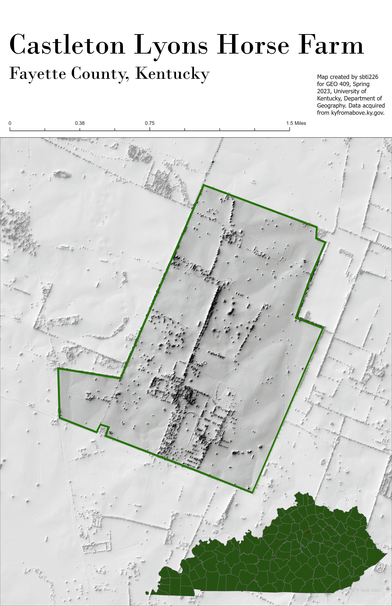
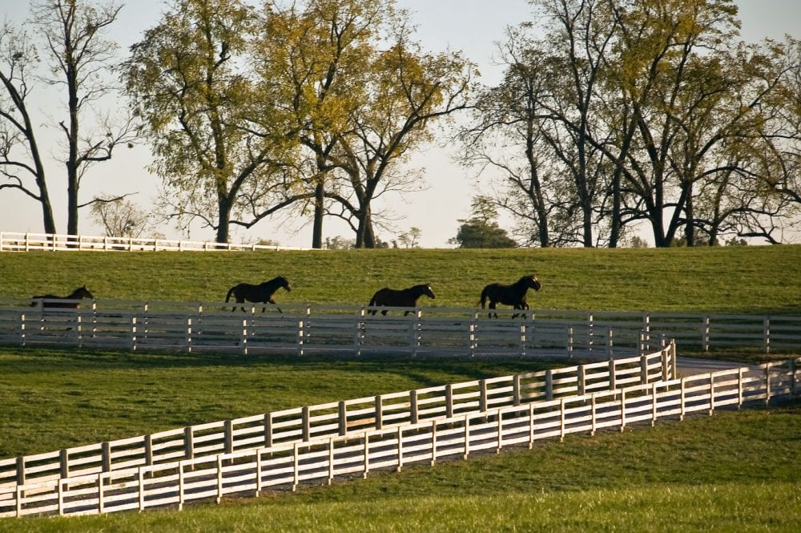
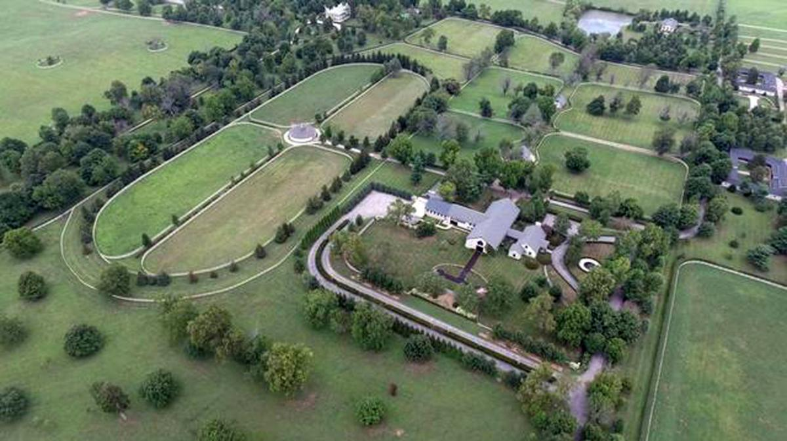
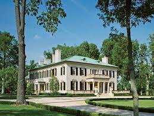
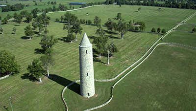

# Castleton Lyons Horse Farm
## Located in northern Fayette County.

Castleton Lyons is one of the largest private horse farms in Kentucky. It is owned by Irish businessman Shane Ryan and boasts several world class stallions.

     
*This map shows the boundary of the horse farm*

[Link to high-resolution version](Layout.pdf)   

## Some features of the farm
     
*Lots of Horses! (Paulick Report)*

     
*Beautiful paddocks and barns (Colin Coyle, The Sunday Times)*

     
*An elaborate historical mansion (Susan Sheehan, Architectural Digest)*

     
*A tower built by Dr. Ryan to bring the beauty of Ireland to the states (Castleton Lyons)*

Map created by sbti226 for GEO 409, Spring 2023, University of Kentucky, Department of Geography. Data acquired from kyraster.ky.gov. Use of ArcGIS and Blender to create image.
